# Tic-Tac-Toe via Monte-Carlo Methods

## Introduction
- **gym-tictactoe** contains a Tic-Tac-Toe environment designed alongside the specs of an environment in OpenAI gym. (taken from (haje01/gym-tictactoe)[https://github.com/haje01/gym-tictactoe])
- There is also a BaseAgent (**base_agent.py**) and a TDAgent (**td_agent.py**) which is trained using Temporal Difference learning (TD-Learning), along with a trained model (**best_td_agent.dat**).
- We need to train our own agents using 2 methods:
    - On-policy Monte-Carlo.
    - Off-policy Monte-Carlo through importance sampling.
- We need to pit our agents against those already present.
- Find below the results.

## :file_folder: File Structure
```bash
.
├── Mc_OffPolicy_agent.dat
├── Mc_OnPolicy_agent
├── Monte-Carlo_Methods.html
├── Monte-Carlo_Methods.ipynb
├── Monte-Carlo_Methods.md
├── Monte-Carlo_Methods_files
├── __pycache__
├── base_agent.py
├── best_td_agent.dat
├── gym-tictactoe
├── human_agent.py
├── mc_agents.py
└── td_agent.py

3 directories, 10 files
```

- **Mc_OffPolicy_agent.dat** - Monte-carlo off policy trained agent.
- **mc_agents.py** - Contains code for the on and off-policy MC agents.

## Brief Observations and Results.

```python
import mc_agents
import base_agent
import td_agent

from collections import defaultdict
from gym_tictactoe.env import TicTacToeEnv, set_log_level_by, agent_by_mark,\
    next_mark, check_game_status, after_action_state, O_REWARD, X_REWARD
```

## Initialize the Tic-Tac-Toe environment


```python
env = TicTacToeEnv(show_number=True)
```

### Plotting Functions


```python
import numpy as np
import matplotlib.pyplot as plt

def plot_mean_and_CI(mean, lb, ub, color_mean=None, color_shading=None):
    # plot the shaded range of the confidence intervals
    plt.fill_between(range(mean.shape[0]),ub, lb,
                     color=color_shading, alpha=.5)
    # plot the mean on top
    plt.plot(mean, color_mean)
    
def plot_mean_and_CI_2(a,mean, lb, ub, color_mean=None, color_shading=None):
    # plot the shaded range of the confidence intervals
    plt.fill_between(a, ub, lb,
                     color=color_shading, alpha=.5)
    # plot the mean on top
    plt.plot(a,mean, color_mean)

def plotting(returns,window_size = 100):
    averaged_returns = np.zeros(len(returns)-window_size+1)
    max_returns = np.zeros(len(returns)-window_size+1)
    min_returns = np.zeros(len(returns)-window_size+1)
    
    
    for i in range(len(averaged_returns)):
      averaged_returns[i] = np.mean(returns[i:i+window_size])
      max_returns[i] = np.max(returns[i:i+window_size])
      min_returns[i] = np.min(returns[i:i+window_size])
    
#     plt.plot(averaged_returns)
    
#     plot_mean_and_CI(averaged_returns,min_returns,max_returns,'g--','g')
    
    return (averaged_returns,max_returns,min_returns)
    
    
def plotting_2(returns,window_size = 100):
    averaged_returns = np.zeros(len(returns))
    max_returns = np.zeros(len(returns))
    min_returns = np.zeros(len(returns))
    
    
    for i in range(len(averaged_returns)-window_size+1):
      averaged_returns[i] = np.mean(returns[i:i+window_size])
      max_returns[i] = np.max(returns[i:i+window_size])
      min_returns[i] = np.min(returns[i:i+window_size])
    
    for i in range(len(averaged_returns)-window_size+1,len(averaged_returns)):
      averaged_returns[i] = np.mean(returns[i:])
      max_returns[i] = np.max(returns[i:])
      min_returns[i] = np.min(returns[i:])
#     plt.plot(averaged_returns)
    
#     plot_mean_and_CI(averaged_returns,min_returns,max_returns,'g--','g')
    
    return (averaged_returns,max_returns,min_returns)
    
   
def Q_sa_estimator(rndm_state_action_state_action,agent):
    
    for rndm in rndm_state_action:
        X = [i for i in range(len(agent.backup[tuple(rndm)]))]
        if len(X) == 0:
            continue
        Y = agent.backup[tuple(rndm)]
        print(np.var(np.array(Y)))
        plt.plot(X,Y)
        plt.legend(rndm)
        plt.show()


# a = plotting(mu,100)
# b = plotting(mu1,100)
# plot_mean_and_CI(a[0],a[1],a[2],'g--','g')
# plt.show()
# plot_mean_and_CI(b[0],b[1],b[2],'b--','b')

# plt.show()

```

## Initialize the TD Agent and the Base Agent


```python
td_agent.load_model(td_agent.MODEL_FILE)
td_agent_ = td_agent.TDAgent('X',0,0)
base_agent_ = base_agent.BaseAgent('X')
```

### Initialize the Monte-Carlo On-Policy Agent


```python
rndm_state_action = [[((0,0,0,1,2,0,0,2,1),'O'),1],[((0,0,0,2,1,1,0,2,0),'X'),1],[((1,0,1,2,1,0,2,0,0),'X'),1],[((1,2,1,2,0,2,2,0,1),'O'),4]]
mc_onpolicy = mc_agents.Mc_OnPolicy('O',0.1,env,1.0)
mc_onpolicy_2 = mc_agents.Mc_OnPolicy('O',0.1,env,1.0)
```

### You can make the agent learn or load a model.


```python
mu_on_td = mc_onpolicy.learn(env,50000,td_agent_,rndm_state_action)
```

    Episode 50000/50000.


```python
mu_on_base = mc_onpolicy_2.learn(env,50000,base_agent_,rndm_state_action)
```

    Episode 50000/50000.

### Initialize the On Policy MC agent with Mark as , epsilon  and discount factor .
### Make the agent learn for N = 50000 epochs and in each epoch play M = 10 games with the TD_Agent.


#### The above agent is a Monte-Carlo agent with On-policy First-Visit Control

Few Implementation details:
<p>
Q(state,action) matrix is initialized to zeros and a random -greedy policy  is chosen at the start of the training.
</p>
In each epoch of training, a random episode is generated using the current policy.(Basically,we make the MC agent compete with itself to generate the episode.)
<p>
For each  in the episode, we store the discounted reward from the first occurence of  in .
</p>
<p>
We also keep track of the total for  and store in  and total number of visits of  in .
</p>
<p>
Finally, we update  as:
</p>

<p align="center">
        
        <br>
        
</p>
<p>
The policy  is updated according to the updated  values.
</p>
<p>
In the agent we choose to play as  and during training  and  are made to play alternatively.
</p>
<p>
In order to incoporate an - greedy policy we generate a random number .If , choose an action randomly, else choose action  or .
</p>

```python
# mc_agents.load_model('Mc_OnPolicy_agent.dat',mc_onpolicy)
```


    {'type': 'Mc_OnPolicy',
     'max_episode': 50000,
     'epsilon': 0.1,
     'discount_factor': 1.0}


```python
mc_agents.play_against(mc_onpolicy,base_agent_,3000,False)
```

    O_WINS = 2589,X_WINS = 184,DRAW = 227


    0.8016666666666666


```python
mc_agents.play_against(mc_onpolicy_2,base_agent_,3000,False)
```

    O_WINS = 2470,X_WINS = 316,DRAW = 214


    0.718


```python
mc_agents.play_against(mc_onpolicy,td_agent_,3000,False)
```

    O_WINS = 0,X_WINS = 0,DRAW = 3000


    0.0


```python
mc_agents.play_against(mc_onpolicy_2,td_agent_,3000,False)
```

    O_WINS = 0,X_WINS = 0,DRAW = 3000


    0.0


```python
fig = plt.figure(figsize = (10,5))
smoothing_window = 100
a = plotting(mu_on_td,smoothing_window)

plot_mean_and_CI(a[0],a[1],a[2],'b--','b')
plt.xlabel("Episode")
plt.ylabel("Episode Reward (Smoothed)")
plt.title("Returns over time against TD_Agent (Smoothed over window size {})".format(smoothing_window))
plt.show()
```


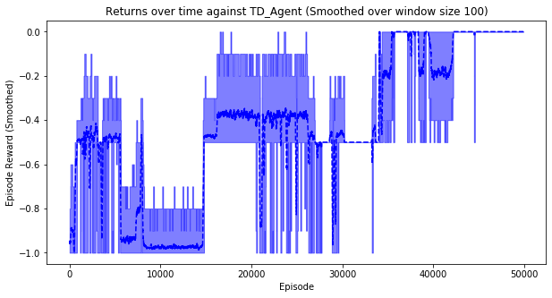


This is the plot for Number of MC rollouts v/s returns confidence interval among N = 10 games against TD_Agent.
Few observations:
- We see that as the number of episodes increases, the expected reward tends to ,when playing against the TD_Agent in each epoch.


```python
fig = plt.figure(figsize = (10,5))
smoothing_window = 100
a = plotting(mu_on_base,smoothing_window)

plot_mean_and_CI(a[0],a[1],a[2],'b--','b')
plt.xlabel("Episode")
plt.ylabel("Episode Reward (Smoothed)")
plt.title("Returns over time against Base_Agent (Smoothed over window size {})".format(smoothing_window))
plt.show()
```


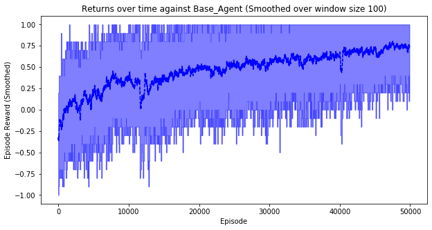


This is the plot for Number of MC rollouts v/s returns confidence interval among N = 10 games against Base_Agent.
Few observations:
- We see that as the number of episodes increases, the expected reward tends to 0.75,when playing against the Base_Agent in each epoch.


```python
d = defaultdict(lambda: [])

for i in range(len(mc_onpolicy.unique_states)):
    d[mc_onpolicy.unique_states[i]].append(mu_on_td[i])

mu_uniq = []
min_uniq = []
max_uniq = []
for keys in d.keys():
    mu_uniq.append(np.mean(d[keys]))
    min_uniq.append(np.min(d[keys]))
    max_uniq.append(np.max(d[keys]))
    
mu_uniq = np.array(mu_uniq)
min_uniq = np.array(min_uniq)
max_uniq = np.array(max_uniq)

a = d.keys()
a = list(a)
# a = np.array(a)
# print(a)
fig = plt.figure(figsize = (10,5))
plot_mean_and_CI_2(a,mu_uniq,min_uniq,max_uniq,'g--','g')
# plt.fill_between(range(mu_uniq.shape[0]),max_uniq,min_uniq,'g',.5)
# plt.plot(a,mu_uniq)
plt.xlabel("Number of unique states")
plt.ylabel("Returns")
plt.title("Returns v/s unique states against TD_Agent")
plt.show()
```


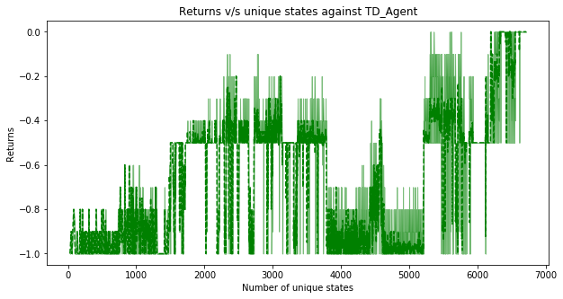


This is the plot of unique sates v/s returns among N = 10 games against the TD_Agent.
Few observations:
- Expected return tends to 0 as number of unique states increases dring the training iterations.


```python
d = defaultdict(lambda: [])

for i in range(len(mc_onpolicy_2.unique_states)):
    d[mc_onpolicy_2.unique_states[i]].append(mu_on_base[i])

mu_uniq = []
min_uniq = []
max_uniq = []
for keys in d.keys():
    mu_uniq.append(np.mean(d[keys]))
    min_uniq.append(np.min(d[keys]))
    max_uniq.append(np.max(d[keys]))
    
mu_uniq = np.array(mu_uniq)
min_uniq = np.array(min_uniq)
max_uniq = np.array(max_uniq)

a = d.keys()
a = list(a)
# a = np.array(a)
# print(a)
fig = plt.figure(figsize = (10,5))
plot_mean_and_CI_2(a,mu_uniq,max_uniq,min_uniq,'g--','g')
# plt.fill_between(range(mu_uniq.shape[0]),max_uniq,min_uniq,'g',.5)
# plt.plot(a,mu_uniq)
plt.xlabel("Number of unique states")
plt.ylabel("Returns")
plt.title("Returns v/s unique states against Base_Agent")
plt.show()
```


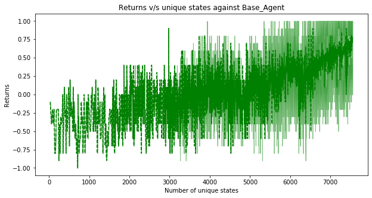


This is the plot of unique sates v/s returns among N = 10 games against the Base_Agent.
Few observations:
- Expected return increases as number of unique states increases dring the training iterations.

### Number of unique states v/s Returns is more effective as compared to Number of episodes v/s Returns as it is more intutive to see how the returns are changing with the increase in number of unique states.


```python
Q_sa_estimator(rndm_state_action,mc_onpolicy)
```

    0.0


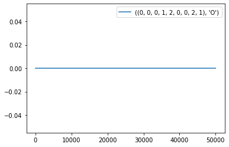


    0.0


    0.0


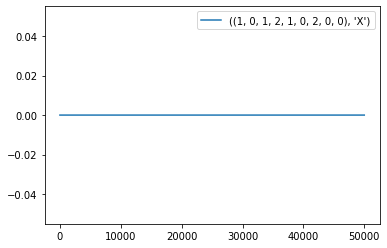


    0.0


```python
Q_sa_estimator(rndm_state_action,mc_onpolicy_2)
```

    0.0


    0.0


    0.24983359000000008


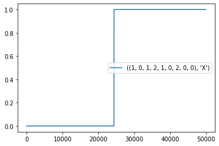


    0.15215616000000004


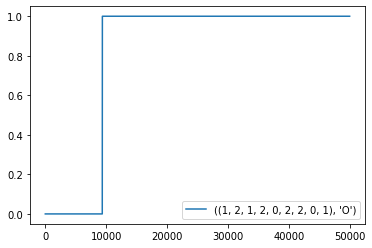


### Plots for the  values over the training iterations for some random  pairs for training with TD_Agent and Base_Agent.


```python
rndm_state_action = [[((0,0,0,1,2,0,0,2,1),'O'),1],[((0,0,0,2,1,1,0,2,0),'X'),1],[((1,0,1,2,1,0,2,0,0),'X'),1],[((1,2,1,2,0,2,2,0,1),'O'),4]]
mc_offpolicy = mc_agents.MC_OffPolicy_Weighted_Importance('O',env,1.0)
mc_offpolicy_2 = mc_agents.MC_OffPolicy_Weighted_Importance('O',env,1.0)
```


```python
mu_off_td = mc_offpolicy.learn(env,50000,td_agent_,rndm_state_action)
```

    Episode 50000/50000


```python
mu_off_base = mc_offpolicy_2.learn(env,50000,base_agent_,rndm_state_action)
```

    Episode 50000/50000

### Initialize the Off Policy MC agent with Mark as  and discount factor .
### Make the agent learn for N = 50000 epochs and in each epoch play M = 10 games with the TD_Agent.


#### The above agent is a Monte-Carlo agent with Off-policy Control with Weighted Importance Sampling.

Few Implementation details:
- Q(state,action) matrix is initialized to zeros and a random -greedy target policy  and a random behavioural policy  is chosen at the start of the training.
- In each epoch of training, a random episode is generated using the behavioural policy.(Basically,we make the MC agent compete with itself to generate the episode.)
- For each  in the episode, we store the discounted reward from the first occurence of  in  and W which was initialized to  is updated as follows:

<p align="center">
    
</p>
Therefore,if  is not updated that is ,then we break.

- We also keep track of the cumulated sum of , which is required for the  update.
- Finally, we update  as:

<p align="center">
        
</p>
<p>
The target policy  is updated according to the updated  values.
</p>
<p>
In the above agent we choose to play as  and during training  and  are made to play alternatively.
</p>
<p>
We choose weigthed importance sampling as opposed to ordinary importance sampling as the variance of ordinary importance sampling rewards can tend to .
</p>

```python
# mc_agents.load_model('Mc_OffPolicy_agent.dat',mc_offpolicy)
```


    {'type': 'Mc_OffPolicy',
     'max_episode': 50000,
     'epsilon': None,
     'discount_factor': 1.0}


```python
mc_agents.play_against(mc_offpolicy,td_agent_,3000,False)
```

    O_WINS = 0,X_WINS = 0,DRAW = 3000


    0.0


```python
mc_agents.play_against(mc_offpolicy,base_agent_,3000,False)
```

    O_WINS = 2612,X_WINS = 17,DRAW = 371


    0.865


```python
mc_agents.play_against(mc_offpolicy_2,td_agent_,3000,False)
```

    O_WINS = 0,X_WINS = 0,DRAW = 3000


    0.0


```python
mc_agents.play_against(mc_offpolicy_2,base_agent_,3000,False)
```

    O_WINS = 2623,X_WINS = 19,DRAW = 358


    0.868


```python
fig = plt.figure(figsize = (10,5))
smoothing_window = 100
a = plotting(mu_off_td,smoothing_window)

plot_mean_and_CI(a[0],a[1],a[2],'b--','b')
plt.xlabel("Episode")
plt.ylabel("Episode Reward (Smoothed)")
plt.title("Returns over time against TD_Agent (Smoothed over window size {})".format(smoothing_window))
plt.show()
```


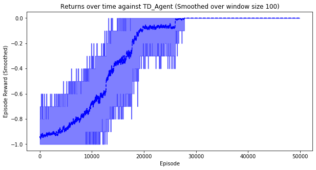


This is the plot for Number of MC rollouts v/s returns confidence interval among N = 10 games against TD_Agent.
Few observations:
- We see that as the number of episodes increases, the expected reward tends to 0.0,when playing against the TD_Agent in each epoch.


```python
fig = plt.figure(figsize = (10,5))
smoothing_window = 100
a = plotting(mu_off_base,smoothing_window)

plot_mean_and_CI(a[0],a[1],a[2],'b--','b')
plt.xlabel("Episode")
plt.ylabel("Episode Reward (Smoothed)")
plt.title("Returns over time against Base_Agent (Smoothed over window size {})".format(smoothing_window))
plt.show()
```


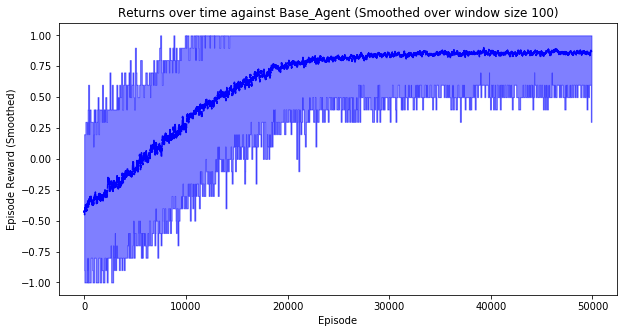


This is the plot for Number of MC rollouts v/s returns confidence interval among N = 10 games against Base_Agent.
Few observations:
- We see that as the number of episodes increases, the expected reward tends to 0.75,when playing against the Base_Agent in each epoch.


```python
d = defaultdict(lambda: [])

for i in range(len(mc_onpolicy.unique_states)):
    d[mc_offpolicy.unique_states[i]].append(mu_off_td[i])

mu_uniq = []
min_uniq = []
max_uniq = []
for keys in d.keys():
    mu_uniq.append(np.mean(d[keys]))
    min_uniq.append(np.min(d[keys]))
    max_uniq.append(np.max(d[keys]))
    
mu_uniq = np.array(mu_uniq)
min_uniq = np.array(min_uniq)
max_uniq = np.array(max_uniq)

a = d.keys()
a = list(a)
# a = np.array(a)
# print(a)
fig = plt.figure(figsize = (10,5))
plot_mean_and_CI_2(a,mu_uniq,max_uniq,min_uniq,'r--','orange')
# plt.fill_between(range(mu_uniq.shape[0]),max_uniq,min_uniq,'g',.5)
# plt.plot(a,mu_uniq)
plt.xlabel("Number of unique states")
plt.ylabel("Returns")
plt.title("Returns v/s unique states against TD_Agent")
plt.show()
```


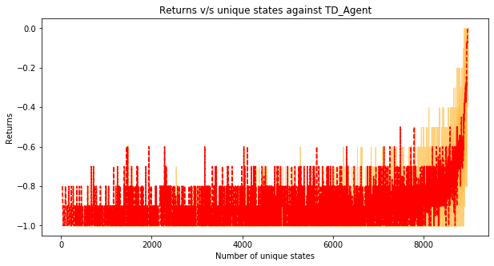


This is the plot of unique sates v/s returns among N = 10 games against the TD_Agent.
Few observations:
- Expected return tends to 0 as number of unique states increases dring the training iterations.


```python
d = defaultdict(lambda: [])

for i in range(len(mc_onpolicy_2.unique_states)):
    d[mc_offpolicy_2.unique_states[i]].append(mu_off_base[i])

mu_uniq = []
min_uniq = []
max_uniq = []
for keys in d.keys():
    mu_uniq.append(np.mean(d[keys]))
    min_uniq.append(np.min(d[keys]))
    max_uniq.append(np.max(d[keys]))
    
mu_uniq = np.array(mu_uniq)
min_uniq = np.array(min_uniq)
max_uniq = np.array(max_uniq)

a = d.keys()
a = list(a)
# a = np.array(a)
# print(a)
fig = plt.figure(figsize = (10,5))
plot_mean_and_CI_2(a,mu_uniq,max_uniq,min_uniq,'r--','orange')
# plt.fill_between(range(mu_uniq.shape[0]),max_uniq,min_uniq,'g',.5)
# plt.plot(a,mu_uniq)
plt.xlabel("Number of unique states")
plt.ylabel("Returns")
plt.title("Returns v/s unique states against Base_Agent")
plt.show()
```


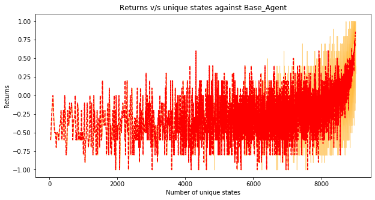


This is the plot of unique sates v/s returns among N = 10 games against the Base_Agent.
Few observations:
- Expected return increases as number of unique states increases dring the training iterations.

### Number of unique states v/s Returns is more effective as compared to Number of episodes v/s Returns as it is more intutive to see how the returns are changing with the increase in number of unique states.


```python
Q_sa_estimator(rndm_state_action,mc_offpolicy)
```

    0.0


    0.1569017856


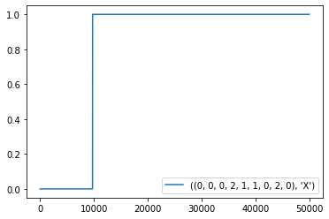


    0.1354989756


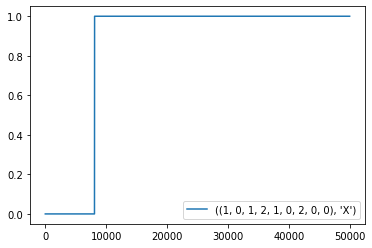


    0.14800919039999996


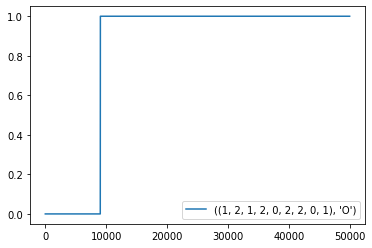


```python
Q_sa_estimator(rndm_state_action,mc_offpolicy_2)
```

    0.0


    0.2344648704


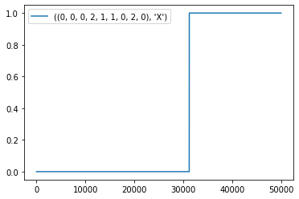


    0.11737292759999995


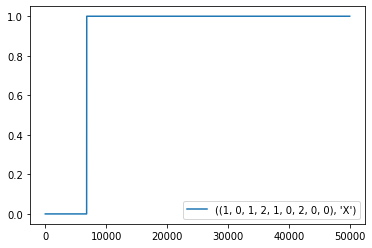


    0.0053312703999999975


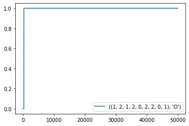


## Observations from the above graphs
- Number of MC rollouts v/s return confidence interval
    - Off Policy control agent converges to the optimal value much faster as compared to the On Policy control agent.
    - Both the agents converge to approximately the same accuracy.
- Number of Unique states v/s return confidence interval
    - Essentially, number of unique states depends on the value of  chosen.
- Value of Q(s,a)
    1. A potential problem in off-policy Monte Carlo is that it learns from the tails of episodes. (But, it depends greatly on the choice of behavioural policy  and hence would require an infinite visits to each  pairs.
    2. For example, if the target policy is greedy over the  values, then any exploration will lead to  to be 0, thus leading to break of the loop (as  is 0). As a result,it will take a long time to learn.
    3. As a result, off policy with weighted importance reduces variance but only learns from tails of episodes whereas in on policy variance is not contolled.

## Question 2.2 Bonus

We observe the graphs of TD_Agent v/s Monte-Carlo agents given above.

### Both Temporal-Difference and Monte-Carlo methods update the value of  based on values of . As a result, from the start of the training, these methods donot have any information of any state transitions or rewards
### As Monte-Carlo methods update based on true value of , they learn relatively faster as compared to TD Methods which update on the basis of some estimate of  values and may fail to converge.
### But, Monte-Carlo Methods can suffer from high variance, which means more samples are needed to achieve the same degree of learning as compared to TD.
### We observe that the TD learning is more effective in problems where we can achieve convergence as compared to Monte-Carlo Methods.

---
References
- Td_agent code and environment code provided in https://github.com/haje01/gym-tictactoe

---

