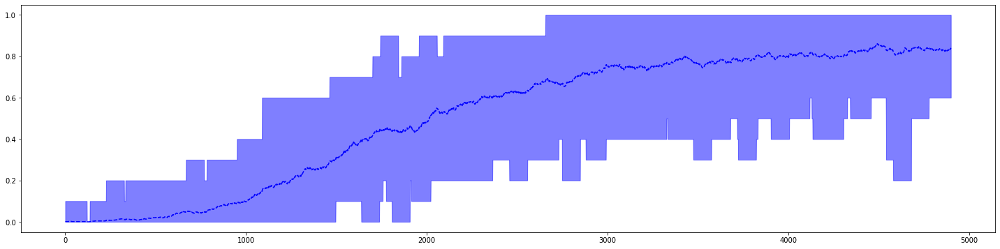
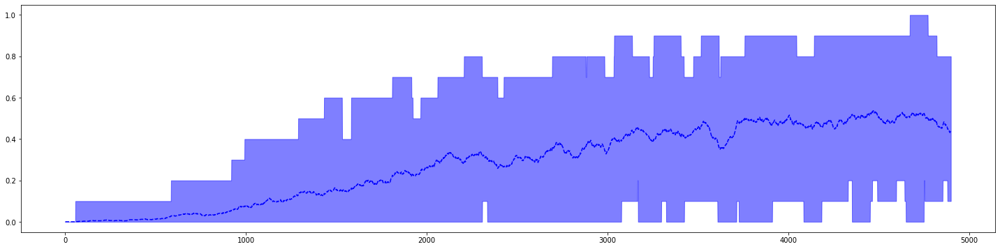
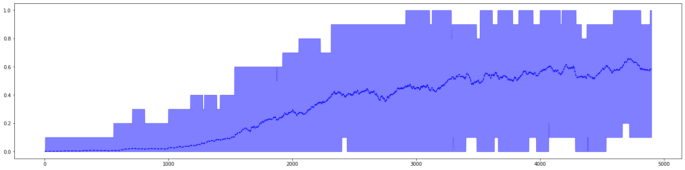
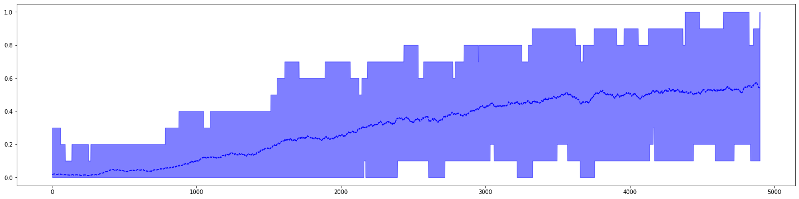
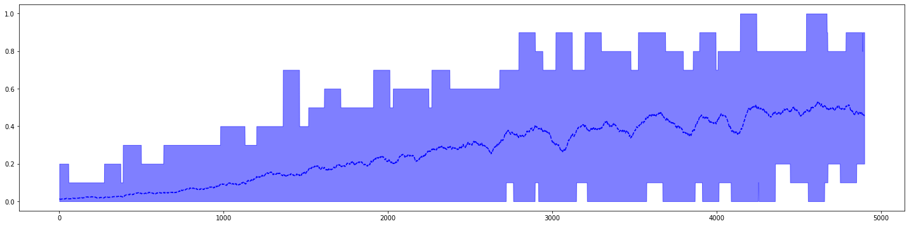
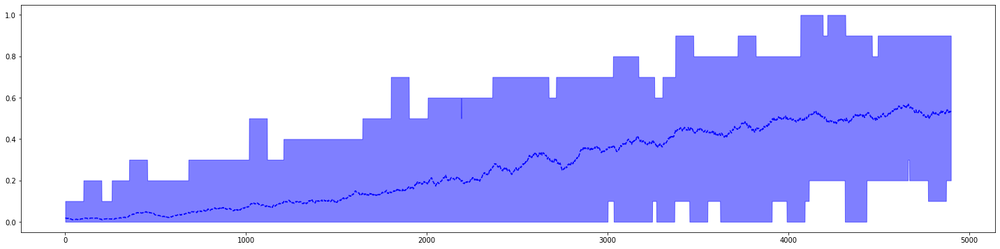

# SARSA, Q-Learning and Expected SARSA for Frozen Lake Problem

## Introduction
- We take **FrozenLake 8X8/4X4** from OpenAI gym and configure it to have suitable number of slippery blocks.
- Implement **SARSA**, **Q-Learning**, **Expected SARSA** agents for the FrokenLake environment.

## :file_folder: File Structure
```bash
.
├── Expected_Sarsa.py
├── Frozen_Lake_Through_TD_Methods.html
├── Frozen_Lake_Through_TD_Methods.ipynb
├── Frozen_Lake_Through_TD_Methods_files
├── Q_Learning.py
├── README.md
├── Sarsa.py
├── __pycache__
└── frozen_lake.py

2 directories, 7 files
```
- **Expected_Sarsa.py, Sarsa.py, Q_Learning.py** - Contains the code for the respective agents.
- **frozen_lake.py** - Contains code for the env taken from OpenAI gym.


```python
import Sarsa
import Q_Learning
import Expected_Sarsa
import frozen_lake
import matplotlib.pyplot as plt
import numpy as np
```

#### Code for testing the implementation


```python
def test(env,agent,num_episodes = 1000):
	R = 0.0
	for episode in range(1,num_episodes+1):

	    if episode%100 == 0:
	        print("\rEpisode {}/{}".format(episode,num_episodes),end = "")
	    # R = 0.0
	    done = False
	    
	    state = env.reset()
	    action = np.argmax(agent.Q[state])

	    while not done:
	        next_state,reward,done,_ = env.step(action)
	        next_action = np.argmax(agent.Q[next_state])
	# 			action = np.random.choice(np.arange(len(probs)),p = probs)
	        # print("State = {},Action = {},Q[s][a] = {}".format(state,action,agent.Q[state]))
	        
	        
	        R += reward
	        state = next_state
	        action = next_action
	        # env.render()
	    # print("-----------")

	print("")
	print(R)
```


```python
def plotting(agent,window_size = 100):
    averaged_returns = np.zeros(len(agent.returns)-window_size+1)
    max_returns = np.zeros(len(agent.returns)-window_size+1)
    min_returns = np.zeros(len(agent.returns)-window_size+1)


    for i in range(len(averaged_returns)):
        averaged_returns[i] = np.mean(agent.returns[i:i+window_size])
        max_returns[i] = np.max(agent.returns[i:i+window_size])
        min_returns[i] = np.min(agent.returns[i:i+window_size])
        
    return (averaged_returns,min_returns,max_returns)

def plot_mean_and_CI(mean, lb, ub, color_mean=None, color_shading=None):
    # plot the shaded range of the confidence intervals
    plt.fill_between(range(mean.shape[0]), ub, lb,
                     color=color_shading, alpha=.5)
    # plot the mean on top
    plt.plot(mean, color_mean)
```


```python
env_FL_small_True = frozen_lake.FrozenLakeEnv(None,"4x4",True)
env_FL_large_True = frozen_lake.FrozenLakeEnv(None,"8x8",True)
env_FL_small_False = frozen_lake.FrozenLakeEnv(None,"4x4",False)
env_FL_large_False = frozen_lake.FrozenLakeEnv(None,"8x8",False)
```

## Implementation Details
### Sarsa
    
1. Sarsa is on-policy algorithm. It implies that it learns the Q-values based on the action performed by the current policy instead of the greedy policy.
2. Update equation of SARSA is
<p align="center">
    
</p>
3. Here, the actions are chosen from a epsilon-greedy policy where  is initially  and finally converges to  using the decay equation:
<p align="center">
    
</p>
4. This is required so as to enable the TD methods to converge. Initially, there is more exploration and eventually it converges to a  - greedy policy.
5.  is also varied inversely proportional to time as:
<p align="center">
    
</p>

### Q-Learning
1. Q-Learning is an off policy TD-control policy.It is exactly like SARSA with the only difference being that it doesnot follow a policy to find the next action but rather directly selects the next action based on the current Q(s,a) values.
2. Update equation of Q-Learning is:
<p align="center">
    
</p>
- In order to make the algorithm converge, we manipulate  as done in SARSA.

### Expected SARSA
1. Expected SARSA takes the expectation of Q values of every possible action in the current state.
2. Update equation is as follows:
<p align="center">
    
</p>


## Environment - Frozen_Lake 8X8 with slippery blocks.


```python
sarsa_agent = Sarsa.Sarsa(env_FL_large_True)
q_learning_agent = Q_Learning.Q_Learning(env_FL_large_True)
expected_sarsa_agent = Expected_Sarsa.Expected_Sarsa(env_FL_large_True)
```


```python
sarsa_agent.learn(env_FL_large_True,50000)
```

    Episode 50000/50000


```python
q_learning_agent.learn(env_FL_large_True,50000)
```

    Episode 50000/50000


```python
expected_sarsa_agent.learn(env_FL_large_True,50000)
```

    Episode 50000/50000


```python
test(env_FL_large_True,sarsa_agent)
```

    Episode 1000/1000
    1000.0


```python
test(env_FL_large_True,q_learning_agent)
```

    Episode 1000/1000
    628.0


```python
test(env_FL_large_True,expected_sarsa_agent)
```

    Episode 1000/1000
    851.0


### Plots of return confidence interval for N = 10 runs. (Runs are taken after every  iteration) 

### SARSA


```python
fig = plt.figure(figsize = (25,6))
a = plotting(sarsa_agent,100)
plot_mean_and_CI(a[0],a[1],a[2],'b--','b')
```





### Q-Learning


```python
fig = plt.figure(figsize = (25,6))
a = plotting(q_learning_agent,100)
plot_mean_and_CI(a[0],a[1],a[2],'b--','b')
```





### Expected SARSA


```python
fig = plt.figure(figsize = (25,6))
a = plotting(expected_sarsa_agent,100)
plot_mean_and_CI(a[0],a[1],a[2],'b--','b')
```





## Environment - Frozen_Lake 4X4 with slippery blocks.


```python
sarsa_agent = Sarsa.Sarsa(env_FL_small_True)
q_learning_agent = Q_Learning.Q_Learning(env_FL_small_True)
expected_sarsa_agent = Expected_Sarsa.Expected_Sarsa(env_FL_small_True)
```


```python
sarsa_agent.learn(env_FL_small_True,50000)
```

    Episode 50000/50000


```python
q_learning_agent.learn(env_FL_small_True,50000)
```

    Episode 50000/50000


```python
expected_sarsa_agent.learn(env_FL_small_True,50000)
```

    Episode 50000/50000


```python
test(env_FL_small_True,sarsa_agent)
```

    Episode 1000/1000
    812.0


```python
test(env_FL_small_True,q_learning_agent)
```

    Episode 1000/1000
    773.0


```python
test(env_FL_small_True,expected_sarsa_agent)
```

    Episode 1000/1000
    847.0


### Plots of return confidence interval for N = 10 runs. (Runs are taken after every  iteration) 

### SARSA


```python
fig = plt.figure(figsize = (25,6))
a = plotting(sarsa_agent,100)
plot_mean_and_CI(a[0],a[1],a[2],'b--','b')
```





### Q-Learning


```python
fig = plt.figure(figsize = (25,6))
a = plotting(q_learning_agent,100)
plot_mean_and_CI(a[0],a[1],a[2],'b--','b')
```





### Expected SARSA


```python
fig = plt.figure(figsize = (25,6))
a = plotting(expected_sarsa_agent,100)
plot_mean_and_CI(a[0],a[1],a[2],'b--','b')
```





## Observations

### Convergence
   - We observe Q-Learning converges much faster as compared to SARSA or Expected SARSA. 
   - In terms of accuracy, SARSA perfoms the best followed by Expected SARSA and then Q-Learning.
   
### Stability
   - All the above TD-Learning algorithms have a problem with convergence and are highly unstable.
   - As Q-Learning uses the max function to estimate Q(s,a) values, it makes highly aggressive updates and is highly unstable.

---
References:
- Sutton and Barton: Reinforcement Learning,Second Edition
  URL: https://www.google.com/url?sa=t&rct=j&q=&esrc=s&source=web&cd=3&ved=2ahUKEwjX7cnp3qPlAhVBeH0KHTGHBBwQFjACegQIAhAC&url=https%3A%2F%2Fweb.stanford.edu%2Fclass%2Fpsych209%2FReadings%2FSuttonBartoIPRLBook2ndEd.pdf&usg=AOvVaw3bKK-Y_1kf6XQVwR-UYrBY
---


