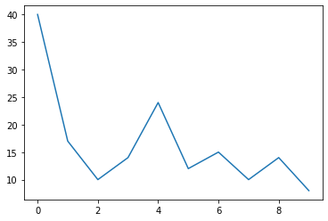
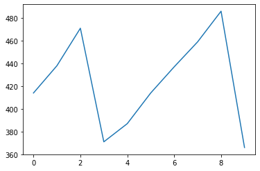

# DQN (Deep Q-Learning Network)


## Environment
- The environment consists of an agent which needs to use a ball to break bricks and score points.
- We receive the current state of the environment in the form of an image of the current state of game.
- Using this we need to estimate the best next action possible and hence use the MSE loss to train our model.
- We can consider the neural net as a black box which takes the set of states as its input and gives the corresponding $Q$ values as output. We can then choose the action = .
- [Here](https://www.youtube.com/watch?v=TmPfTpjtdgg) is a very inteersing video on how the DQN agent agent learns.

## :file_folder: File Structure
```bash
.
├── DQN_Agent.py
├── Function_Approximation_DQN.html
├── Function_Approximation_DQN.ipynb
├── Function_Approximation_DQN_files
├── README.md
├── __pycache__
└── cartpole-dqn.h5

2 directories, 5 files
```
- **DQN_Agent.py** - Code for the DQN agent.
- **cartpole-dqn.h5** - Trained DQN agent on the cartpole problem.


## DQN Algorithm
- Main idea in DQN is we try to estimate  values as in other TD Algorithms but instead of filling a  matrix, we train a neural network.
- We try to minimize the loss in each episode/epoch.Loss is given by:
<p align="center">
    
</p>
- The algorithm tens to forget the previous experiences as it overwrites them with new experiences, so in order to overcome this we come up with the idea of replay experience.
- Basically, we store some states (video frames) into buffer and sample a mini_batch of samples to train the deep network. This forms a input dataset stable enough for training.Samples are iid as they are randomly smapled from buffer.

### Target Network
- we create 2 deep networks. We use the first one to fix the target and update the 2nd one.This is done so that we have a stable target to chase.

## As Atari Breakout was fairly complex to write and took a lot of time to trian, so I implemented the DQN on a much simpler problem of Cart-pole.
- It is fairly simple problem, in which we have to balance a stick on a platform by moving left or right. [Cartpole](https://gym.openai.com/envs/CartPole-v1/)


```python
import gym
from DQN_Agent import DQNAgent,learn
import numpy as np
import matplotlib.pyplot as plt
```

    Using TensorFlow backend.


```python
env = gym.make('CartPole-v1')
state_size = env.observation_space.shape[0]
action_size = env.action_space.n
agent = DQNAgent(state_size, action_size)

G = learn(env,agent,10)
```

    episode: 0/10
    episode: 1/10
    episode: 2/10
    episode: 3/10
    episode: 4/10
    episode: 5/10
    episode: 6/10
    episode: 7/10
    episode: 8/10
    episode: 9/10


```python
plt.plot(G)
```


    [<matplotlib.lines.Line2D at 0x7f63d05d5a20>]





```python
def test(env,agent,episodes):
    G = []


    for e in range(episodes):
        state = env.reset()
        state = np.reshape(state, [1, agent.state_size])
        for time in range(500):
            # env.render()
            action = agent.act(state)
            next_state, reward, done, _ = env.step(action)
            reward = reward if not done else -10
            next_state = np.reshape(next_state, [1, agent.state_size])
            
            state = next_state
            if done:
                print("episode: {}/{}, score: {}"
                  .format(e, episodes, time))

                G.append(time)
                break
            

    return G
```


```python
agent = DQNAgent(state_size, action_size)
agent.load("./cartpole-dqn.h5")
agent.epsilon = 0.0
G = test(env,agent,10)
```

    episode: 0/10, score: 414
    episode: 1/10, score: 438
    episode: 2/10, score: 471
    episode: 3/10, score: 371
    episode: 4/10, score: 387
    episode: 5/10, score: 414
    episode: 6/10, score: 437
    episode: 7/10, score: 459
    episode: 8/10, score: 486
    episode: 9/10, score: 366


```python
plt.plot(G)
```


    [<matplotlib.lines.Line2D at 0x7f63d0061518>]





---
References:
- title: RL — DQN Deep Q-network 
  url: https://medium.com/@jonathan_hui/rl-dqn-deep-q-network-e207751f7ae4
- title: Lec-3-DQN
  url: https://drive.google.com/file/d/0BxXI_RttTZAhVUhpbDhiSUFFNjg/view
- title: deep-q-atari
  url: https://github.com/danielegrattarola/deep-q-atari
- title: Reinforcement Learning (DQN) Tutorial
  url: https://pytorch.org/tutorials/intermediate/reinforcement_q_learning.html
